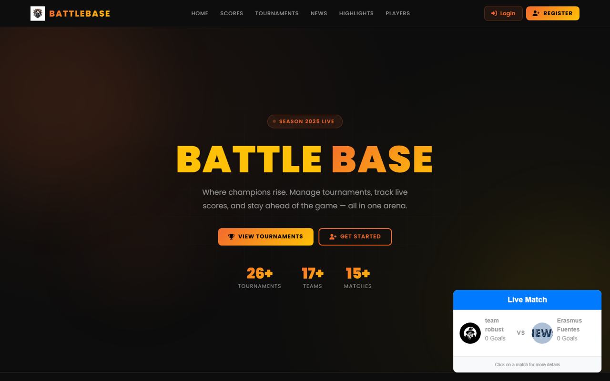
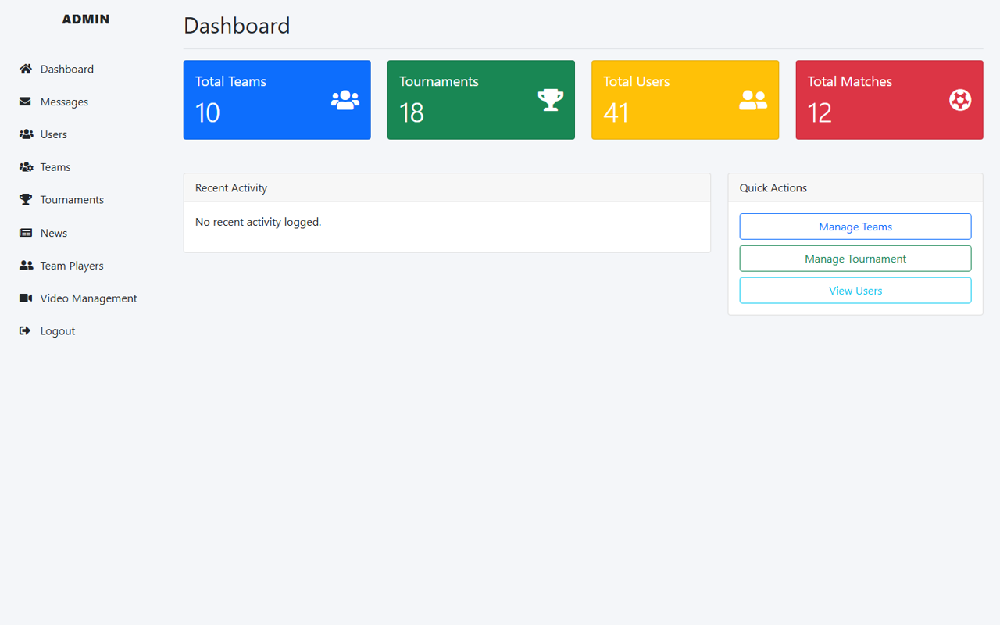

# 🏆 TournyMate (BattleBase): Tournament Management System

> *Where champions rise. Manage tournaments, track live scores, and stay ahead of the game — all in one arena.*

TournyMate is a full-stack web application for running local sports tournaments. Organisers create tournaments and schedule matches, team managers register teams and players, officials update scores live, and fans follow results, points tables, news and highlights. The public site is branded **BattleBase**.

It was built with PHP and MySQL as a Database Management Systems course project at United International University.



## ✨ Features

### For visitors
- **Live match widget** on the home page, refreshed with AJAX (`fetch_live_score.php`)
- **Tournaments:** scheduled, ongoing and past tournaments with venues and dates
- **Scores & points tables:** match results and standings per tournament
- **Players:** player profiles and individual scoring records
- **News & highlights:** articles and match videos
- **Contact form:** messages go to the admin inbox

### For registered users (`dashboard/user/`)
- **Profile** with photo upload
- **Teams:** create a team, add or remove members, edit or delete it (the creator becomes the team manager)
- **Tournaments:** request, create and edit tournaments; organisers manage matches and officials
- **Match officials:** update live scores for assigned matches
- **News & highlights:** publish and manage posts and videos
- **Notifications** for tournament and team activity

### For administrators (`Admin/`)
- **Dashboard** with totals for teams, tournaments, users and matches
- **Manage** users, teams, team players, tournaments, news and videos
- **Messages** inbox for contact-form submissions



## 🛠️ Tech stack

| Layer | Technology |
|---|---|
| Backend | PHP 8 (PDO with prepared statements) |
| Database | MySQL / MariaDB |
| Frontend | HTML, CSS, Bootstrap, JavaScript (AJAX for live scores) |
| Auth | PHP sessions, bcrypt password hashing |

## 🗄️ Database

The schema in [`db/tourny_mate.sql`](db/tourny_mate.sql) has 17 tables, including:

| Table | Holds |
|---|---|
| `userinfo`, `admin` | User and admin accounts |
| `team`, `team_player`, `player` | Teams, squads and players |
| `tournament`, `tournament_team`, `tournament_request`, `tournament_officials` | Tournaments, entries, hosting requests and officials |
| `match_played`, `score`, `individual_score`, `tournament_team_score` | Fixtures, results and scoring |
| `news`, `highlights`, `contact` | Content and contact messages |

The dump includes sample data (18 tournaments, 10 teams, 41 users) so the site isn't empty on first run.

## 🚀 Getting started

### Prerequisites

- PHP 8.0+ with the `pdo_mysql` extension
- MySQL 8+ or MariaDB 10.6+
- Optionally XAMPP or Laragon, which bundle both

### 1. Clone and import the database

```bash
git clone https://github.com/salahuddinselim/tourny_mate.git
cd tourny_mate
mysql -u root -p -e "CREATE DATABASE tourny_mate CHARACTER SET utf8mb4"
mysql -u root -p tourny_mate < db/tourny_mate.sql
```

### 2. Configure the connection

Edit the database settings in **both** `config.php` (public site) and `Admin/config.php` (admin panel):

```php
$host = "localhost";
$dbname = "tourny_mate";
$username = "root";
$password = "";
```

### 3. Set the admin password

The dump ships with a placeholder admin password, so set your own. Store it as plain text once; on first login the app replaces it with a bcrypt hash automatically:

```sql
UPDATE admin SET pass_key = 'choose-a-strong-password' WHERE username = 'selim';
```

### 4. Run

```bash
php -S localhost:8000
```

- Public site: http://localhost:8000
- Admin panel: http://localhost:8000/Admin/admin_login.php

With XAMPP, copy the folder into `htdocs/` and open `http://localhost/tourny_mate` instead.

## 📁 Project structure

```text
tourny_mate/
├── index.php, allTournaments.php, allScores.php, players.php, news.php, highlights.php, ...
├── login.php, register.php, profile.php      # authentication and profile
├── fetch_live_score.php, get_notifications.php  # AJAX endpoints
├── config.php                                  # database connection (public site)
├── dashboard/user/                             # signed-in user dashboard
│   └── menu/{team,tournament,news,highlights,player,profile}/
├── Admin/                                      # admin panel + its own config.php
├── components/shared/                          # shared header, footer and nav
├── css/, js/, fonts/, images/                  # front-end assets
├── uploads/, photos/                           # user-uploaded logos and photos
└── db/tourny_mate.sql                          # schema + sample data
```

## 🙏 Credits

The public site's visual design started from a free template by [ThemeWagon](https://themewagon.com/) and was customised for BattleBase.

## 👤 Author

**Salah Uddin Selim** · [Portfolio](https://salah-uddin-selim.vercel.app) · [GitHub](https://github.com/salahuddinselim)
